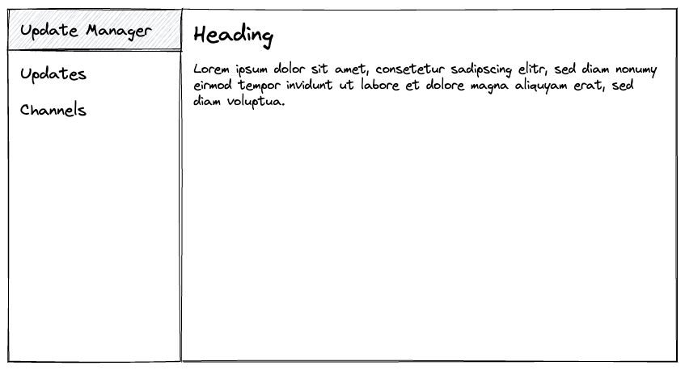
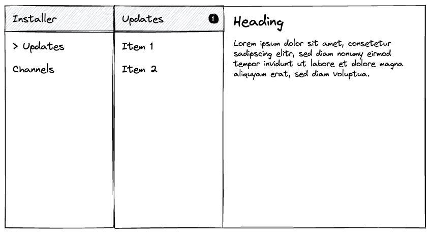
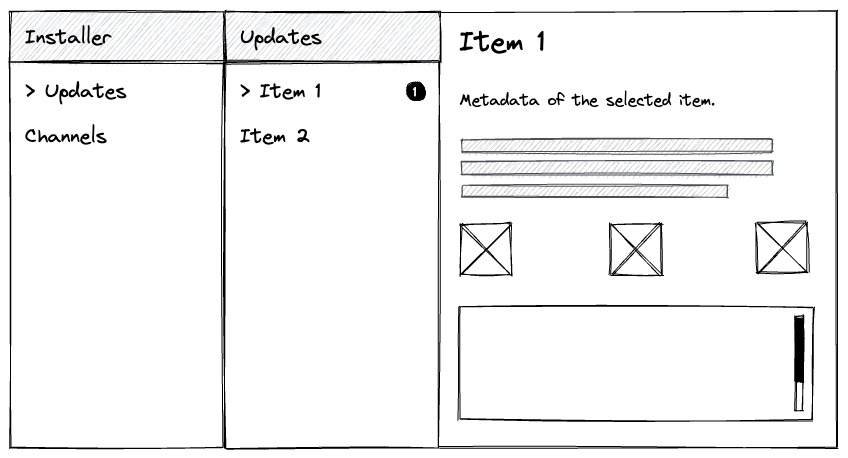
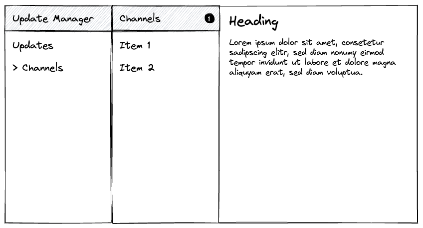
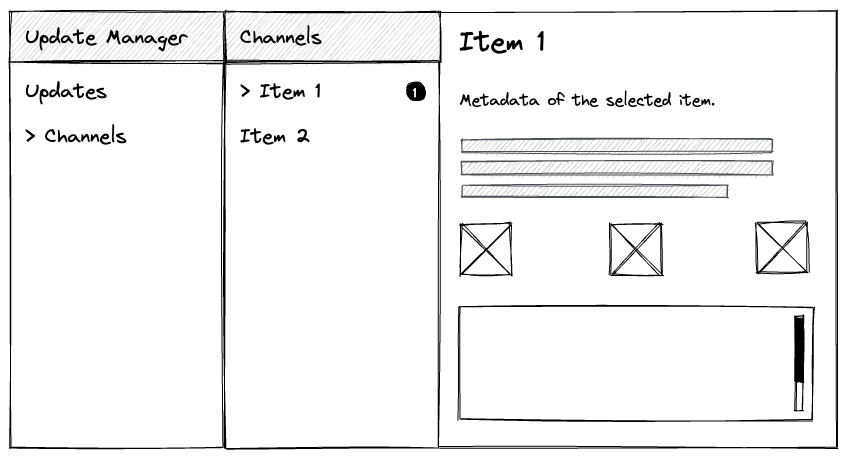

= HAL-1827 Update the server installation using the Web Console
:author:            Harald Pehl
:email:             hpehl@redhat.com
:toc:               left
:icons:             font
:idprefix:
:idseparator:       -
:issue-base-url:    https://issues.redhat.com/browse

== Overview

EAP 8 introduces a new way of updating a server. These features are references in this RFE as the "update manager". Details about the update manager are out of the scope of this document. They can be found in the analysis documents of {issue-base-url}/EAP7-1917[EAP7-1917] and {issue-base-url}/EAP7-1984[EAP7-1984].

This document describes how the console will support the update manager. It is only supported for EAP and not available in WildFly.

== Issue Metadata

=== Issue

* {issue-base-url}/HAL-1827[HAL-1827]

=== Related Issues

* {issue-base-url}/EAP7-1984[EAP7-1984]
* {issue-base-url}/EAP7-1917[EAP7-1917]
* {issue-base-url}/WFCORE-6206[WFCORE-6206]

=== Dev Contacts

* mailto:{email}[{author}]

=== QE Contacts

* mailto:jjedlick@redhat.com[Jakub Jedlicka]

=== Testing By

* [ ] Engineering
* [x] QE

=== Affected Projects or Components

This RFE affects the management console. It depends on the management operations added by {issue-base-url}/EAP7-1917[EAP7-1917].

=== Other Interested Projects

None

=== Relevant Installation Types

* [x] Traditional standalone server (unzipped or provisioned by Galleon)
* [x] Managed domain
* [ ] OpenShift s2i
* [ ] Bootable jar

== Requirements

The console must support the update manager while still supporting patching in mixed domain mode with older hosts (7.4.x and below). The UI will show the old patching UI if such a host is selected in a mixed domain. In all other scenarios, the new update manager UI will be used. This is especially true for the standalone mode, where only the new UI is supported.

Decision matrix:

Standalone mode

* only the update manager is supported
* patching is *not* supported

Domain mode

* depends on the selection of the host
** `/core-service=installer` is present -> show update manager UI
** `/core-service=patching` is present -> show patching UI

=== Hard Requirements

The console must support the new management operations introduced by {issue-base-url}/EAP7-1917[EAP7-1917]:

* Update a server installation
    * online
    * using a ZIP file
* Revert an update
* View updates history
* List subscribed channels
* Subscribe to a new channel
* Edit a channel subscription
* Unsubscribe from a channel
* Restart to apply an update/revert
* Upload a custom patch
* Clean the update manager

See the implementation plan below on how these features are implemented in the console.

=== Nice-to-Have Requirements

* Export server snapshot

=== Non-Requirements

* Promote a Domain Controller to be an artifacts server

== Implementation Plan

This section only describes the new update manager UI. The old patching UI remains unchanged and is out of the scope of this document.

=== Homepage

In domain mode the homepage has a section about patching. This section is renamed to "Update Manager", and the content is updated to reflect the basic steps for using the update manager. This section is now also available in standalone mode.

=== Update Manager Top Level Category

The old patching top level category is replaced by a new top level category named "Update Manager". This new top level category contains a https://hal.github.io/documentation/concepts/#finder[finder] with columns to manage updates and channels.

==== Update Manager Column

When the new top level category is selected, the update manager column is displayed as the initial column. It contains two static items:

. <<updates-column,Updates>>
. <<channels-column,Channels>>

The preview area gives an overview of the update manager and how it works in the console.

.Update manager column in standalone mode

[#updates-column]
==== Updates Column

The updates column shows the installations, updates and rollbacks returned by the `/core-service=installer:history()` operation. The list of entries is sorted by timestamp, with the newest entry appearing first.

The column provides the following actions ❶:

* Update Server: Updates a server installation using the three-phase process described in the analysis document of {issue-base-url}/EAP7-1917[EAP7-1917]. The three steps are implemented using a wizard.
    . Check if there are available updates
    . Prepare the update
    . Apply the update
* Upload ZIP: Updates the server installation by uploading a ZIP file. This action is implemented using a wizard.
* Refresh: Refreshes the list of items.
* Clean: Cleans any leftovers. A confirmation dialog is shown, before executing the action.

The preview area describes the available features.

.Updates column

==== Updates Item

An update item represents one model node of the `result` array returned by `/core-service=installer:history()`. The console uses the following information to render the item:

* Hash: The revision hash
* Timestamp: The timestamp of the commit
* Type: The type of the commit: `rollback`, `update` or `install`
* An icon representing the type

The item provides the following actions ❶:

* Revert: Revert the update or the rollback. Only available if the type is `update`.

The preview shows the following information:

* Hash: The revision hash
* Timestamp: The timestamp of the commit
* Type: The type of the commit: `rollback`, `update` or `install`
* The artifact changes
* The channel changes

.Update item

[#channels-column]
==== Channels Column

The channels column shows the subscribed channels as returned by `/core-service=installer:read-resource(include-runtime=true)`.

The column provides the following actions ❶:

* Subscribe: Subscribes to a channel using a modal dialog.
* Refresh: Refreshes the list of items.

The preview area describes the available features.

.Channels column

==== Channel Item

The console uses the following information to render a subscribed channel:

* Name of the channel
* Type of the manifest: GAV or URL
* An icon representing the type of the manifest

The item provides the following actions ❶:

* View: View the channel in an https://hal.github.io/documentation/concepts/#applications[application] view. The channel can be modified using this view.
* Unsubscribe: Unsubscribes the channel. A confirmation dialog is shown, before performing the action.

The preview shows the following information:

* Name of the channel
* Repositories
* Manifest

.Channel item

== Open Questions

None

== Test Plan

Additional tests are added to the https://github.com/hal/berg[hal/berg] test suite to verify the update features.

== Community Documentation

See the official HAL website at https://hal.github.io
